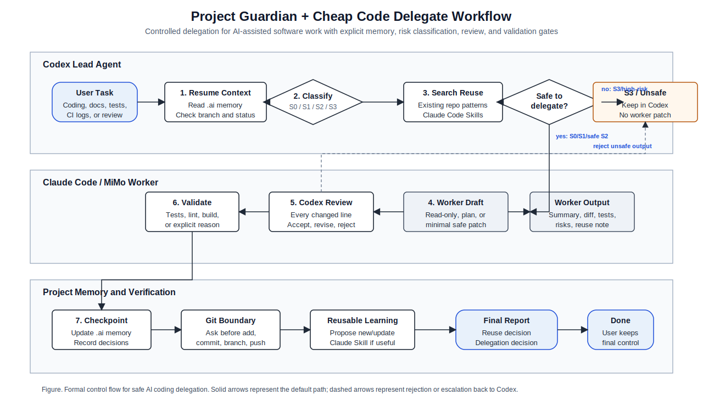

# Project Guardian + Cheap Code Delegate

[](https://github.com/ECdison6227/project-guardian-cheap-code-delegate/actions/workflows/validate.yml)

English | [中文](#中文)

Two local Codex skills for safer, cheaper, and more repeatable AI-assisted software work.

- `project-guardian` keeps project memory, git status, resume notes, and checkpoints organized.
- `cheap-code-delegate` helps Codex classify engineering tasks and delegate only mechanical, low-risk work to Claude Code/MiMo while Codex stays responsible for review and final decisions.

This repository is intentionally small: it contains skill instructions, deterministic shell helpers, installation logic, and validation checks.

## Workflow



## Why This Exists

Codex is best used for judgment-heavy work: architecture, review, safety decisions, and integrating context. Many engineering subtasks are lower-risk and repetitive: searching a repo, summarizing logs, finding test commands, drafting boilerplate, or producing narrow patches. This project gives Codex a repeatable workflow for sending those subtasks to a cheaper local worker without giving up control.

## Skills

### `project-guardian`

Use when starting, resuming, modifying, checkpointing, or ending a project session.

It manages:

- `.ai/state.json`
- `.ai/memory/PROJECT_MEMORY.md`
- `.ai/memory/SESSION_LOG.md`
- `.ai/memory/CHECKPOINTS.md`
- `.ai/memory/DECISIONS.md`
- `.ai/memory/TODO.md`
- `.ai/memory/PAPER_CONTEXT.md`

It never runs destructive git commands, commits, pushes, or deployment commands automatically.

### `cheap-code-delegate`

Use before coding, debugging, refactoring, testing, linting, documentation updates, CI log analysis, repository inspection, boilerplate generation, or repetitive project work.

It classifies work as:

- `S0`: mechanical tasks
- `S1`: simple localized implementation
- `S2`: medium-risk local work
- `S3`: never delegate

Only S0, S1, and safe narrow S2 work should be delegated. Codex must review every changed line produced by the worker.

## Install

Clone the repository and run:

```bash
./scripts/validate.sh
./install.sh
```

Default install target:

```text
~/.agents/skills
```

Install somewhere else:

```bash
./install.sh --target "$HOME/.codex/skills"
```

Dry-run install:

```bash
./install.sh --dry-run
```

## Usage

Inventory Claude Code skills:

```bash
~/.agents/skills/cheap-code-delegate/scripts/claude_skill_inventory.sh
```

Run a read-only delegation dry run:

```bash
~/.agents/skills/cheap-code-delegate/scripts/cheap_delegate.sh \
  --mode readonly \
  --dry-run \
  --task "Inspect this repository and summarize test commands."
```

Initialize project memory:

```bash
~/.agents/skills/project-guardian/scripts/project_guardian.sh init \
  --task "Start a new project"
```

Resume project context:

```bash
~/.agents/skills/project-guardian/scripts/project_guardian.sh resume
```

## Safety Boundaries

These tools do not automatically:

- push to git remotes
- run `git reset` or `git clean`
- create commits
- deploy
- delete project data
- modify secrets
- edit production configuration

Sensitive work stays with Codex: security, auth, permissions, payments, database migrations, concurrency, public API design, broad rewrites, and final merge decisions.

## Repository Layout

```text
.
├── install.sh
├── scripts/
│   └── validate.sh
├── docs/
│   └── usage.md
└── skills/
    ├── cheap-code-delegate/
    │   ├── SKILL.md
    │   ├── references/
    │   ├── scripts/
    │   └── templates/
    └── project-guardian/
        ├── SKILL.md
        ├── references/
        ├── scripts/
        └── templates/
```

## Requirements

- macOS, Linux, or another Unix-like environment
- Bash
- Git
- Optional: `claude` CLI for delegation
- Optional: `shellcheck` for stricter script linting

`cheap_delegate.sh` falls back to `CHEAP_CODE_CMD` when `claude` is unavailable.

## Validation

```bash
./scripts/validate.sh
```

The validation script checks required files, skill frontmatter, bash syntax, and smoke tests. It runs `shellcheck` only when available.

## License

MIT License. See [LICENSE](LICENSE).

---

# 中文

两个用于本地 Codex 工作流的 Skill，让 AI 编程协作更安全、更省成本、更可复用。

- `project-guardian`：管理项目记忆、Git 状态、恢复摘要和工作检查点。
- `cheap-code-delegate`：让 Codex 先判断任务风险，再把机械、低风险、可验证的工作委派给 Claude Code/MiMo；Codex 仍然负责审查和最终决定。

这个仓库保持小而清晰：只包含 Skill 指令、确定性的 shell 辅助脚本、安装脚本和验证脚本。

## 工作流


## 为什么需要这个项目

Codex 更适合做需要判断力的工作：架构、审查、安全边界、上下文整合。很多工程子任务其实更机械：搜索仓库、总结日志、找测试命令、生成样板代码、起草窄范围 patch。这个项目提供一套可重复的流程，把这些低风险任务交给更便宜的本地 worker，同时不把最终控制权交出去。

## Skill 说明

### `project-guardian`

适用于开始项目、恢复项目、修改前后、写检查点、结束工作会话。

它管理：

- `.ai/state.json`
- `.ai/memory/PROJECT_MEMORY.md`
- `.ai/memory/SESSION_LOG.md`
- `.ai/memory/CHECKPOINTS.md`
- `.ai/memory/DECISIONS.md`
- `.ai/memory/TODO.md`
- `.ai/memory/PAPER_CONTEXT.md`

它不会自动执行破坏性 Git 命令，不会自动提交、推送或部署。

### `cheap-code-delegate`

适用于编码、调试、重构、测试、lint、文档更新、CI 日志分析、仓库检查、样板代码生成和重复性项目工作之前。

它把任务分为：

- `S0`：机械任务
- `S1`：简单局部实现
- `S2`：中等风险的局部工作
- `S3`：禁止委派

只有 S0、S1 和安全窄范围的 S2 可以委派。worker 产出的每一行改动都必须由 Codex 审查。

## 安装

克隆仓库后运行：

```bash
./scripts/validate.sh
./install.sh
```

默认安装位置：

```text
~/.agents/skills
```

安装到其他位置：

```bash
./install.sh --target "$HOME/.codex/skills"
```

只预览安装行为：

```bash
./install.sh --dry-run
```

## 使用

查看本地 Claude Code Skills：

```bash
~/.agents/skills/cheap-code-delegate/scripts/claude_skill_inventory.sh
```

执行只读委派 dry-run：

```bash
~/.agents/skills/cheap-code-delegate/scripts/cheap_delegate.sh \
  --mode readonly \
  --dry-run \
  --task "Inspect this repository and summarize test commands."
```

初始化项目记忆：

```bash
~/.agents/skills/project-guardian/scripts/project_guardian.sh init \
  --task "Start a new project"
```

恢复项目上下文：

```bash
~/.agents/skills/project-guardian/scripts/project_guardian.sh resume
```

## 安全边界

这些工具不会自动：

- 推送到 Git 远端
- 运行 `git reset` 或 `git clean`
- 创建提交
- 部署
- 删除项目数据
- 修改 secrets
- 修改生产配置

安全、权限、支付、数据库迁移、并发、公开 API 设计、大范围重写和最终合并决策仍然由 Codex 负责。

## 仓库结构

```text
.
├── install.sh
├── scripts/
│   └── validate.sh
├── docs/
│   └── usage.md
└── skills/
    ├── cheap-code-delegate/
    │   ├── SKILL.md
    │   ├── references/
    │   ├── scripts/
    │   └── templates/
    └── project-guardian/
        ├── SKILL.md
        ├── references/
        ├── scripts/
        └── templates/
```

## 环境要求

- macOS、Linux 或其他类 Unix 环境
- Bash
- Git
- 可选：用于委派的 `claude` CLI
- 可选：用于更严格脚本检查的 `shellcheck`

如果没有 `claude`，可以通过 `CHEAP_CODE_CMD` 指定兼容 worker。

## 验证

```bash
./scripts/validate.sh
```

验证脚本会检查必需文件、Skill frontmatter、bash 语法和 smoke tests。只有在本机安装了 `shellcheck` 时才会运行 shellcheck。

## 许可证

MIT License。见 [LICENSE](LICENSE)。
